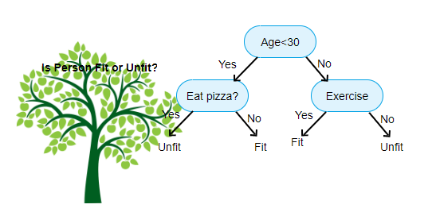

# `XGBoost`: A Gentle Introduction

**Author**: [Mr. BuYang](zechangsun.github.io)

**Email**: szc22@mails.tsinghua.edu.cn

[TOC]

## Background

Before introducing the protagonist of this blog - `XGBoost`, I would like to first introduce its ancestor - decision tree and two basic ideas of model aggregating - bagging and boosting for people without machine learning background in this section.

### Decision Tree

------

A [decision tree][1] is a flowchart-like structure in which each internal node represents a "test" on an feature, each branch represents the outcome of the test, and each leaf node represents a class label. The paths from root to leaf represent classification rules.

Above figure gives an example of decisision tree. The way decision tree works is highly non-linear and similar to human decision process. As such, decision tree performs well on tasks e.g. classification and regression, and has very good interpretability. As a brief summary, we only introduce its basic concept here. For interesting readers who want to know the details of how to build a decision tree, we refer to [[2]][2].

### Bagging and Boosting

------

In practice, a single decision tree suffers from limited prediction power and lack of robustness. To solve those problems, two strategies, bagging and boosting, have been proposed to aggregate a number of decision trees into an ensemble model.

**B**ootstrap **agg**regat**ing**, **bagging**, makes bootstrap replicates of the training set and using these as new learning sets to train multiple versions of predictors (see [[3]][3]). The final predictions are then the vote or average of these predictors. A famous example of bagging is  *random forest* (see [[4]][4]).

**Boosting** (see [[5]][4]) is a way of combining the performance of many "weak" classifiers to produce a powerful "committee".  Boosting works by sequentially applying a classification algorithm to reweighted versions of the training data and then taking a weighted majority cote of the sequence of classifiers thus produced. A famous example of boosting is *Adaboost* (see [[5]][5]).

## `XGBoost`

`XGBoost` is a scalable end-to-end tree boosting system which have scalability in all scenarios (see [[6]][6]). 

The major contributions of `XGBoost` compared to other tree-boosting algorithms are listed below:

* a highly scalable end-to-end tree boosting system;
* a theoretically justified weighted quantile sketch for efficient proposal calculation;
* a novel sparisty-aware algorithm for parallel tree learning;
* an effective cache-aware block structure for out-of-core tree learning.

Compared to other tree-learning algorithms, `XGBoost` is easy to be implemented in today large datasets and is powerful in both prediction accuracy and efficiency.

### Algorithm Design

------

#### Gradient Tree Boosting

For a given data set with $n$ examples and $m$ features $\mathcal{D}=\left\{(\mathbf{x}_i, y_i)|\mathbf{x}_i\in\mathbb{R}, y_i\in\mathbb{R}, i=1,\dots,n\right\}$, a tree ensemble model can be formalized using $K$ additive functions:
$$
\hat{y} = \phi(\mathbf{x}_i)=\sum_{k=1}^K f_k(\mathbf{x}_i),\,f_k\in\mathcal{F},
$$
where $\mathcal{F}=\left\{f(\mathbf{x})=w_{q(\mathbf{x})}\right\}(q:\mathbb{R}^m\rightarrow T, w\in\mathbb{R}^T)$ is the space of regression trees (also known as CART). $q$ represents the structure of each tree that maps an example to the corresponding leaf index. $T$ is the number of leaves in the tree. Each $f_k$ corresponds to an independent tree structure $q$ and leaf weights $w$.

The regularized objective for this tree ensemble model is then:
$$
\mathcal{L}(\phi) = \sum_i l(\hat{y}_i,y_i)+\sum_k \Omega(f_k).
$$
$l$ is a differentiable convex loss function that measures the differences between the prediction $\hat{y}_i$ and the target $y_i$.

The regularized term $\Omega$ which penalizes the complexity of the model is defined as
$$
\Omega(f) = \gamma T + \frac{1}{2}\lambda ||w||^2.
$$
Above tree ensemble model in Equation (1) with objective in Equation (2) can not be optimized directly using traditional optimization methods in Euclidean space. Instead, the model is trained in an additive manner
$$
\mathcal{L}^{(t)} = \sum_{i=1}^n l(y_i, \hat{y}_i^{(t-1)}+f_t(\mathbf{x}_i))+\Omega(f_t),
$$
which means that we greedily add the $f_t$ that most improves our model according to Equation (2). To quickly optimize the objective in the general setting, we expand Equation (4) to second order and find
$$
\tilde{\mathcal{L}}^{(t)}\approx \sum_{i=1}^n\left[g_i f_t(\mathbf{x}_i)+\frac{1}{2}h_i f_t^2(\mathbf{x}_i)\right] + \Omega(f_t).
$$
Note that the constant terms have been removed to obtain above simplified objective at step $t$.

Define $I_j = \{i|q(\mathbf{x_i})=j\}$ as the instance set of leaf $j$. Then Equation (5) can be written as:
$$
\tilde{\mathcal{L}}^{(t)}=\sum_{j=1}^T\left[\left(\sum_{i\in I_j} g_i\right)w_j + \frac{1}{2}\left(\sum_{i\in I_j}h_i+\lambda\right)w_j^2\right]+\gamma T.
$$
If we fix the structure $q(\mathbf{x})$, the optimal weight $w^*_j$ of leaf $j$ is:
$$
w^*_j = -\frac{\sum_{i\in I_j} g_i}{\sum_{i\in I_j}h_i+\lambda}.
$$
The corresponding optimal value is:
$$
\tilde{\mathcal{L}}(q) = -\frac{1}{2}\sum_{j=1}^T \frac{\left(\sum_{i\in I_j} g_i\right)^2}{\sum_{i\in I_j} h_i+\lambda} + \gamma T.
$$

#### Split Finding Algorithms

As we have found the optimal weight for each tree structure, we now hope to find the optimal tree structure with some **split finding algorithms**. 

Assume that $I_L$ and $I_R$ are the instance sets of left and right nodes after the split. Letting $I=I_L\cup I_R$, then the loss reduction after this split is given by
$$
\mathcal{L}_{split} = \frac{1}{2}\left[\frac{(\sum_{i\in I_L} g_i)^2}{\sum_{i\in I_L}h_i +\lambda}+\frac{(\sum_{i\in I_R} g_i)^2}{\sum_{i\in I_R}h_i +\lambda}-\frac{(\sum_{i\in I} g_i)^2}{\sum_{i\in I}h_i +\lambda}\right]-\gamma
$$
We use Equation (9) to evaluate the split candidates.

There are two split finding algorithms - basic exact greedy algorithm and approximate algorithm.

The basic exact greedy algorithm scan each feature and each data point to find the optimal split point.

The approximate algorithm, however, proposes a series of split candidates by percentiles for each feature and use those split candidates to perform same procedures as the basic exact greedy algorithm.

For interested readers, we refer to *Algorithm 1* and *Algorithm 2* in [[6]][6] for detailed pesudo code of above two split finding algorithms. 

Apparently, the approximate algorithm can achieve similar performance as the basic exact greedy algorithm with much less time cost as long as the proposed percentile candidates are good enough. However, finding such candidate split points is a non-trival problem. As we hope those candidates to distribute evenly on the data, a rank function which represents the proportion of instances whose feature value $k$ is smaller than $z$ is defined as:
$$
r_k(z) = \frac{1}{\sum_{(x, h)\in \mathcal{D}_k} h}\sum_{(x,h)\in\mathcal{D}_k, x<z}h,
$$
in which $\mathcal{D}_k = \left\{(x_{1k}, h_1), (x_{2k}, h_2),\dots,(x_{nk}, h_n)\right\}$ represents the $k$-th feature values and second order gradient statistics of each training instances.

We hope to find candidate split points $\left\{s_{k1}, s_{k2},\dots, s_{kl}\right\}$, such that $\left|r_k(s_{k,j})-r_k(s_{k, j+1})\right|<\epsilon$, in which $\epsilon$ is an approximate factor. Intuitively, Equation (10) indicates that there is roughly $1/\epsilon$ candidate points.

For large datasets, finding candidate points satisfy above criteria is hard, and in [[6]][6], they give a novel distributed weighted quantile sketch algorithm which can handle weighted data with a provable theoretical guarantee, but we won't detail this here.

#### Sparsity-aware Split Finding

For read-world application, the algorithms have to consider sparse input problem, which may be caused by:

* presence of missing values in the data;
* frequent zero entries in the statistics;
* artifacts of feature engineering like one-hot encoding.

To solve this problem, `XGBoost` adds a default direction in each tree node and learns the best direction to handle missing values. This can be done by only visiting the non-missing entries, and enumerate missing value to decide  the best default direction.

### System Design

------

This section will give brief introduction for how to optimizing the computation process for `XGBoost`.

#### Column Block for Parallel Learning

Firstly, the most time consuming part of tree learning is to get the data into sorted order. In order to reduce the cost of sorting, the data is stored in in-memory units, which are called *block*. The data is sorted in the beginning can then can be reused in later iterations.

In the exact greedy algorithm, we store the entire dataset in a single block and run the split search algorithm by linearly scanning over the pre-sorted entries.

In the approximate algorithms, multiple blocks can be used in this case, with each block corresponding to subset of rows in the dataset. Different blocks can be distributed across machines, or stored on disk in the out-of-core setting. And collecting statistics for each column can be parallelized, giving us a parallel algorithm for split finding. The column block structure also supports column subsampling.

#### Cache-aware Access

Secondly, the data in the algorithm is accessed in order of feature, which is a non-continuous memory access and slows down split finding when the gradient statistics do not fit into CPU cache and cache miss occur.

For the exact greedy algorithm, we can alleviate the problem by cache-aware prefetching algorithm.

For the approxiamte alorithms, we solve this problem by choosing a correct block size. Choosing an overly small block size results in samll workload for each thread and leads to inefficient parallelization. On the other hand, overly large blocks result in cache misses, as the gradient statistics do not fit into the CPU cache.

#### Blocks for Out-of-core Computation

Besides processors and memory, it's important to utilize disk space to handle data that doesn't fit into main memory. To enable out-of-core computation, we divide the data into multiple blocks and store each block on disk. 

Two techiniques are employed to improve the out-of-core computation: **Block Compression** and **Block Sharding**. 

## Conclusion

`XGBoost` is a powerful classical machine learning algorithm which is scalable end-to-end tree boosting system. An excellent work in both algorithm and system design. For astronomical applications, it will play an important role for ML problem with heterocastic features and something like feature ranking.

## Reference

*  https://en.wikipedia.org/wiki/Decision_tree
*  https://www.aitimejournal.com/@akshay.chavan/a-comprehensive-guide-to-decision-tree-learning
*  https://www.stat.berkeley.edu/~breiman/bagging.pdf
*  https://link.springer.com/article/10.1023/a:1010933404324
*  https://www.researchgate.net/publication/228776646_Additive_Logistic_Regression_A_Statistical_View_of_Boosting
* https://ui.adsabs.harvard.edu/abs/2016arXiv160302754C

[1]: https://en.wikipedia.org/wiki/Decision_tree
[2]: https://www.aitimejournal.com/@akshay.chavan/a-comprehensive-guide-to-decision-tree-learning
[3]: https://www.stat.berkeley.edu/~breiman/bagging.pdf
[4]: https://link.springer.com/article/10.1023/a:1010933404324
[5]: https://www.researchgate.net/publication/228776646_Additive_Logistic_Regression_A_Statistical_View_of_Boosting
[6]: https://ui.adsabs.harvard.edu/abs/2016arXiv160302754C

